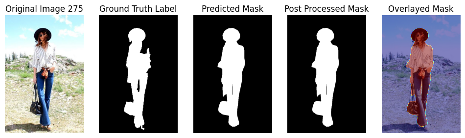
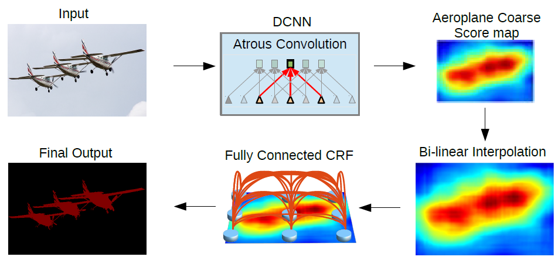

# Fashion Pixel Project

Goal 1: Automatically label each pixel as either `person` or `background`

Goal 2: Automatically label each pixel as either: `background`, `skin`, `hair`, `t-shirt`, `shoes`, `pants`, `dress`


## Approaches


- Convolutional neural networks
- Edge detection
- Conditional random fields
- Super-pixels
- Region Adjacency Graphs
- K-means and Clustering

## U-2-NET

reference:

Qin, Xuebin and Zhang, Zichen and Huang, Chenyang and Dehghan, Masood and Zaiane, Osmar and Jagersand, Martin, "U2-Net: Going Deeper with Nested U-Structure for Salient Object Detection", 2020; https://arxiv.org/pdf/2005.09007.pdf

https://github.com/xuebinqin/U-2-Net

### Design 👷‍♂️


#### model architecture

U-2-Net uses a unique two-level nested U-structure architecture, allowing for deeper network exploration and high-resolution attainment without large memory and computation spikes. The network has a U-structure design. The lower-level features are captured by a residual U-block, which extracts intra-stage multi-scale features and preserves feature map resolution. The upper level mirrors a U-Net configuration, with each stage populated by an RSU block.

#### training process

To train the model, the suggested loss function is a multi-binary-cross entropy loss fusion function, which takes a weighted sum of the outputs from the different layers before they are fused.

I used the same train-valid-test split as suggested; however, I randomized the image ordering and used a fixed seed. When training, I used a batch size of 12 images and a 1 image batch for validation.
When training this model, I did find it useful to apply random transformations to the images and observed higher test accuracy when doing so. I used the Adam optimizer with a learning rate of 0.001 and saved a snapshot of the model every 2000 epochs.

The training time to train this model was very long, and the model was very inaccurate unless it was trained for many epochs. I decided to **not** use this model and use it for tests because making new iterations and testing became very slow.

#### evaluation

I used a combination of Mean IOU and Global Pixel wise accuracy to evaluate this model. I evaluated the model on a random set of 240 images from the dataset (40% of the dataset).

- Mean IOU: ~ 96%
- Global Pixel wise accuracy: ~ 99%

I only evaluated the model on the person/background pixel labeling task since I did not move forward using this model.

### Examples 🎨

The following predictions were made on a model I trained for 14000 epochs.

| | |
| :-----------------------------------------------------------------: | :-----------------------------------------------------------------: |
|  |  |

I added a post-processing step for this model that thresholds some of the pixel values you can see there are some blurry spots from when the images are fused.

| | |
| :------------------------------------------------------------------------------------: | :---------------------------------------------------------------------------------------------: |
|  before |  after |

### Key findings 🔑 & Challenges 🗻

Convolutional neural networks are not a one-step solution to solving problems. Architecture details have an impact on many parts of the design, including the training step and any post-processing that needs to be done.

Long training times and no way to load pre-trained weights were hard to get around. Training the model took so long that I decided not to train a multi-label model. This model was very complex and difficult to train, so I ended up not going past a trial stage using it.

### Future work 🔮

The researchers that created U-2-NET also created a smaller version that takes up less space and may be faster to train. This may be something to look into if I explore this model again. I would also spend more time training a U-2-NET model to make multi-label pixel predictions and working on caching some pre-trained weights to speed up training.

## DeepLabv3

reference:

Liang-Chieh Chen, George Papandreou, Florian Schroff, Hartwig Adam, "Rethinking Atrous Convolution for Semantic Image Segmentation", 2017; https://arxiv.org/pdf/1706.05587.pdf

https://pytorch.org/hub/pytorch_vision_deeplabv3_resnet101

https://github.com/pytorch/vision
https://github.com/pytorch/vision/blob/main/torchvision/models/resnet.py

### Design 👷‍♂️


#### model architecture

The main architecture consists of a ResNet backbone, followed by the ASPP module and a decoder module. The ASPP module captures multi-scale information, while the decoder module refines the features and predicts the final segmentation mask.

The ResNet backbone of the DeepLabv3 model consists of multiple layers of bottleneck blocks, with each layer gradually reducing the spatial dimensions while increasing the number of channels, allowing the model to extract important image features.

Then comes the ASPP module. What separates DeepLabv3 is the use of the atrous spatial pyramid pooling (ASPP) operation. Each atrous convolution can be represented as a fully connected layer. The larger ASPP layer captures multi-scale information from this.

employ multiple parallel dilated (atrous) convolutions with different rates.
ASPP module operates on the feature maps produced by the encoder part of the network and applies dilated convolutions with different dilation rates.
Atrous Spatial Pyramid Pooling
Goal: enlarge the receptive field of the network without increasing the number of parameters or downsampling the features
Allows the deeplab models Ive coded to capture both local details and global context
Using multiple parallel dilated convolutions helps to analyze the the image at multiple scales and aggreagate information from different receptive fields.
Precise, robust, (hopefully scale invariant)

Finally, the decoder module acts as a refiner over the features predicted in the ASPP layer and makes the final pixel labeling prediction.

#### training process

To train the model, the suggested loss function is a cross-entropy loss fusion function. I also tested using a weighted cross-entropy function with different weights for each class and a dice loss function. I had good results by giving the background a lower weight compared to the other classes.

I used the same train-valid-test split as suggested; however, I randomized the image ordering and used a fixed seed. I trained using a batch size of 8 images and image batches of 8 for validation.

The training time to train this model was very short, about 7 seconds per epoch, and the model was quite accurate even if only trained for a few epochs. I observed validation loss to be at a minimum around epoch 20. By loading the model's RESNET101 backbone using pre-trained weights, I was able to speed up the training time and increase the test accuracy.

When training this model, I used the Adam optimizer as well as a fairly low learning rate of 0.00005–0.0001.
I also used a learning rate scheduler that would bring the learning rate to a plateau and change the learning rate less frequently.

I tried applying different transformations (random horizontal flip, random scale, random crop) to the training images but did not observe higher test accuracies when I did so.

#### evaluation

I used a combination of Mean IOU and Global Pixel wise accuracy to evaluate this model. I evaluated the model on a random set of 240 images from the dataset (40% of the dataset).

person/background pixel labeling:

- Mean IOU: ~ 95.7%
- Global Pixel wise accuracy: ~ 98.5%

fashion pixel labeling:

- Mean IOU: ~ 54.2%
- Global Pixel wise accuracy: ~ 94.2%

### Examples 🎨

The following predictions were made on a model I trained for 25 epochs

| | |
| :-----------------------------------------------------------------------: | :-----------------------------------------------------------------------: |
|  |  |

| | |
| :-----------------------------------------------------------------: | :-----------------------------------------------------------------: |
|  |  |

### Key findings 🔑 & Challenges 🗻

I realized that the labels on the training set were not perfect. Some had gaps where there weren't supposed to be, and others had similar small disparities. Additionally, I found there to be some ambiguous fashion-ground truth labels. For example, a skirt in image 154 that has the texture and shape of the bottom of a dress is classified as pants on the ground truth label. Any type of suit or pullover, even ones that look like shirts, are classified as background in the ground truth. In image 568, there are other people fairly close in the background. There are many different odd events in the data set, and I thought about using a different dataset entirely. I learned that the training data you use is a very important factor in how the model you train behaves.

Using this model, there were sometimes small regions that were misclassified. I wrote an additional post-processing step to get rid of small connected regions.

The shapes are not exact for some of the predictions, and the neural network is not as conservative in some of the regions as it should be.

### Future work 🔮

Another way to explore improving predictions is through conditional random fields. See the section below for how I use this to improve predictions. I could also try tuning the learning process by trying different optimizers with more loss functions (using the Jaccard index or IOU as a potential loss function).

## DeepLabv3+

reference:

Liang-Chieh Chen, Yukun Zhu, George Papandreou, Florian Schroff, and Hartwig Adam, "Encoder-Decoder with Atrous Separable
Convolution for Semantic Image Segmentation", 2018; https://arxiv.org/pdf/1802.02611.pdf

### Design 👷‍♂️


#### model architecture

DeepLabv3+ primarily introduces the encoder-decoder architecture, making it more accessible and comprehensible. The model is split into two stages: an encoder and a decoder to capture low-level features. Similar to DeepLabv3, the model aims to capture the important semantic features needed to learn how to properly label the pixels of an image.

The main architecture consists of a ResNet backbone, followed by the ASPP module. Then there is a split between the features, and some features are sent to the decoder, where they are catted and upscaled again to arrive at the final prediction.

#### training

I use the same training configuration as I do for DeepLabv3, as described above. However, the time it took to train this model was slightly longer, with each epoch taking about 37 seconds.

#### evaluation

I used a combination of Mean IOU and Global Pixel wise accuracy to evaluate this model. I evaluated the model on a random set of 240 images from the dataset (40% of the dataset).

person/background pixel labeling:

- Mean IOU: ~ 94.8%
- Global Pixel wise accuracy: ~ 98.1%

fashion pixel labeling:

- Mean IOU: ~ 51.5%
- Global Pixel wise accuracy: ~ 93.4%

### Examples 🎨

The following predictions were made on a model I trained for 25 epochs

| | |
| :------------------------------------------------------------------------: | :------------------------------------------------------------------------: |
|  |  |

| | |
| :------------------------------------------------------------------: | :------------------------------------------------------------------: |
|  |  |

## Conditional Random Fields

reference:

Liang-Chieh Chen, George Papandreou, Senior Member, IEEE, Iasonas Kokkinos, Member, IEEE, Kevin Murphy, and Alan L. Yuille, Fellow, IEEE, "DeepLab: Semantic Image Segmentation with Deep Convolutional Nets, Atrous Convolution, and Fully Connected CRFs", 2017; https://arxiv.org/pdf/1606.00915.pdf



I used a library that implements a CRF as a Pytorch neural net layer for image segmentation. I believe there are newer, more powerful libraries; however, the C++ build process for those libraries was broken. I used the same training method as I did for the DeepLab models but added the CRF module as a post-processing step.

### Key findings 🔑 & Challenges 🗻

The permutohedral module was broken for some of the newer, more accurate implementations.

### Future work 🔮

I may want to implement the permutohedral module myself as a useful utility for pixel labeling tasks such as this.

## Superpixels and Graph based segmentation

reference:

Pedro F. Felzenszwalb, Daniel P. Huttenlocher, "Efficient Graph-Based Image Segmentation", 2004; https://cs.brown.edu/people/pfelzens/papers/seg-ijcv.pdf

### Design 👷‍♂️

My proposed design is as follows: remove the background from the image using a CNN, then segment the image into superpixels using Felzenszwalb's proposed segmentation algorithm. Then reduce the number of segments using a region adjacency graph or K-means to group similar super pixels. Classify groups using a classifier. I used the DeepLabv3 model I built above to classify each superpixel as the most predominant label predicted for each segmented superpixel.

### Examples 🎨

| |
| :------------------------------------------------------------------------------: |
|  |

### Key findings 🔑 & Challenges 🗻

My initial idea for the end stage of my architecture was to build a dataset and separate classifiers for superpixels and classify them separately as their own images. However, I was unable to create good grouping on super pixels by just using color and adjacency techniques. The dataset of fashion item images became unreasonably large.

When reducing the number of segments, the color palette was also reduced and did not take into consideration certain parts of the image where details were lost.
It is important to be picky with the information you choose to get rid of.

One potential challenge I noticed was that sometimes superpixels that were misclassified took away from the detail, and in those scenarios, CNN was making better predictions on its own.

### Future work 🔮

Research different algorithms I could use to create a better grouping of superpixels.
Define more features on each superpixel; this could help during training and when grouping the fashion images.
I included an example notebook of how pose detection could give some insight into classifying superpixels; this may be something I could look into in the future.

I found a useful paper that may help me implement more superpixel features for further iterations of the project: https://www.cs.toronto.edu/~urtasun/publications/simo_et_al_accv14.pdf

## Usage

install the requirements

```
pip install -r requirements.txt
```

to run the web app

```
python app.py
```

or try the notebooks

Main implementation is in `mynotebook.ipynb`

Super pixel extensions are in `superpixel.ipynb`

Testing out pose dectection is in `mypose.ipynb`

My other trial code for U-2-NET ... is in `/trials`

<br>

dataset adapted from:

Kota Yamaguchi, M Hadi Kiapour, Luis E Ortiz, Tamara L Berg, "Parsing Clothing in Fashion Photographs", CVPR 2012
http://vision.is.tohoku.ac.jp/~kyamagu/research/clothing_parsing/


additional references:

Ihor Shylo, "Improving Performance of Image Segmentation with Conditional Random Fields (CRF)", 2020
https://medium.com/@ihor.shylo/improving-performance-of-image-segmentation-with-conditional-random-fields-crf-8b93f7db396c

https://github.com/jfzhang95/pytorch-deeplab-xception

https://github.com/Mr-TalhaIlyas/Conditional-Random-Fields-CRF


